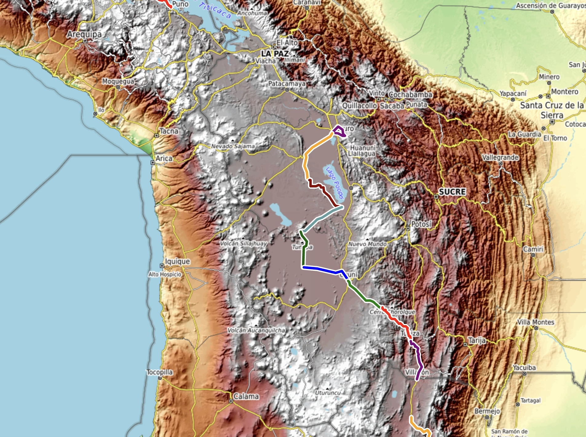
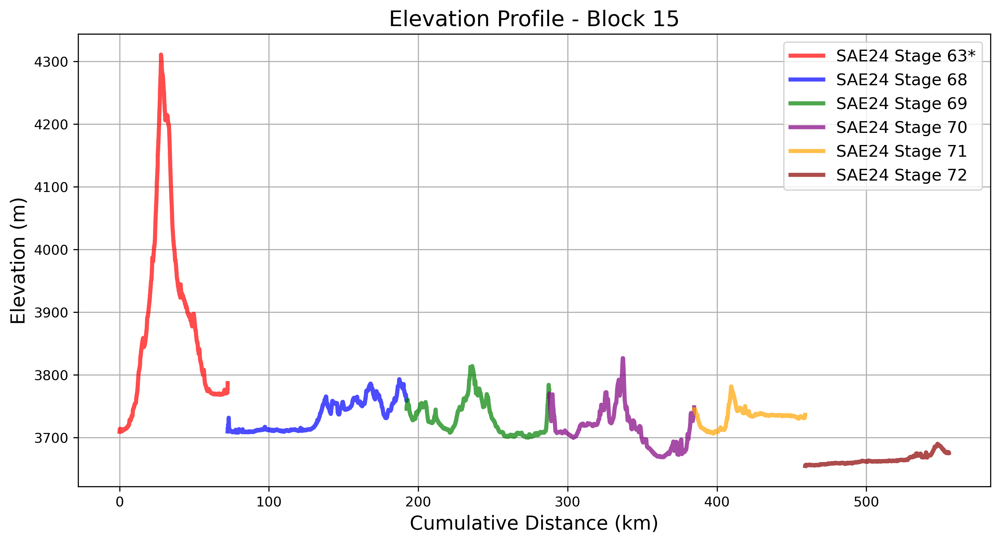
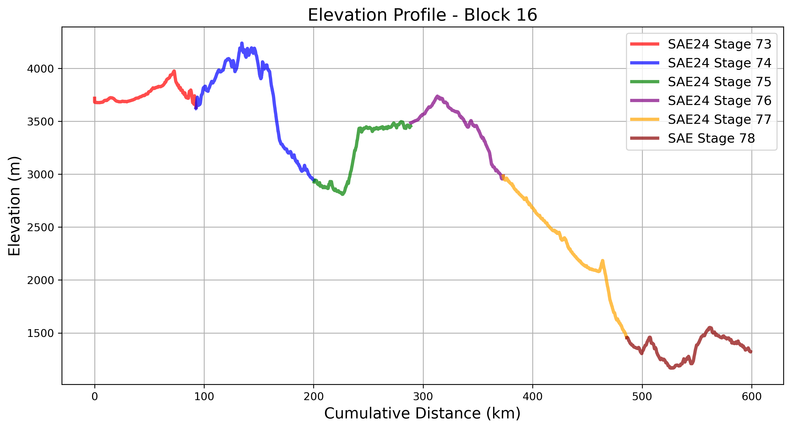

# Bolivia
## Cycling Through The High-Altitude Altiplano  

Bolivia’s section of the **South American Epic** is defined by the **vast, windswept Altiplano**, where cyclists traverse some of the **highest roads on the continent**. The route moves from **Oruro** toward the famous **Salar de Uyuni**, before crossing into **Argentina**. The thin air, rugged terrain, and expansive salt flats create a surreal and demanding cycling experience.

Each **block** below highlights key geographic features, along with an interactive map of the actual routes ridden.

---

## **Block 15: Oruro to Uyuni**  

The route climbs into Bolivia’s high-altitude plains, where the air is **thin and dry**. Riders pass through **isolated landscapes**, experiencing long stretches of **remote dirt roads** and extreme **temperature swings**.

    

        <iframe src="_static/maps/block_15_map.html" 
                style="width: 100%; height: 400px; border: none; box-shadow: 0 0 5px rgba(0,0,0,0.2);"
                scrolling="no" allowfullscreen></iframe>
    

    

        
    

---

## **Block 16: Uyuni to Salta, Argentina**  

This section features the legendary **Salar de Uyuni**, the world’s largest salt flat. The flat, blindingly white surface provides a one-of-a-kind riding experience before the route begins its descent into **Argentina**. The crossing from **high-altitude Bolivia** into **Northwest Argentina** brings a dramatic shift in landscape and culture.

    

        <iframe src="_static/maps/block_16_map.html" 
                style="width: 100%; height: 400px; border: none; box-shadow: 0 0 5px rgba(0,0,0,0.2);"
                scrolling="no" allowfullscreen></iframe>
    

    

        
    

### 8️⃣ Two Days Cycling The Salt Flats in Bolivia  
  
🎥 **[Watch on YouTube](https://www.youtube.com/watch?v=kUMi0Jfqp2E)** – by [TDA Global Cycling](https://www.youtube.com/@tdacycling)  

---

## **Closing Thoughts**  

Bolivia provides some of the **most unique terrain** of the entire expedition. The extreme altitude, **stunning salt flats**, and **endless horizons** create an environment that is both **harsh and awe-inspiring**. 

With Bolivia behind, the journey now continues into **Argentina**, where the route transitions into **rolling valleys and historic colonial towns**. 🚴‍♂️

