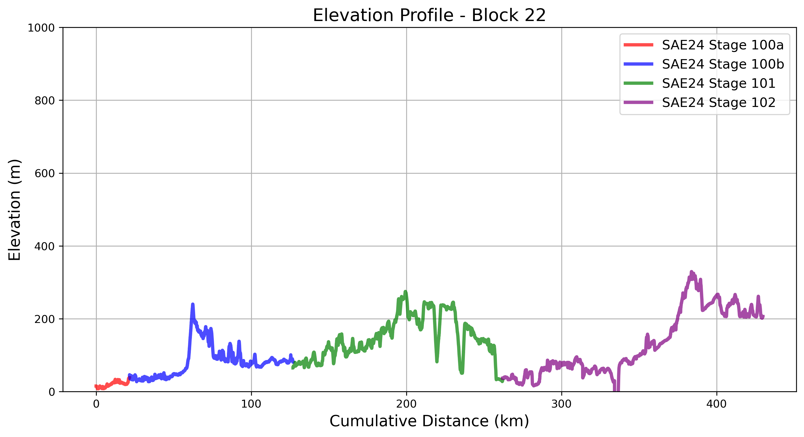
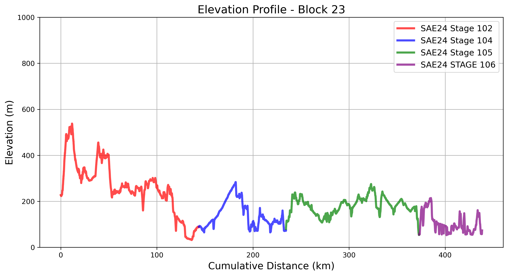

# Chile
## Cycling Through Coastal Ranges and Volcanic Lakes  

Chile’s segment of the **South American Epic** is a journey through **diverse landscapes**, from **Santiago’s central valley** to the **lush lake district** of the south. Riders follow **rolling coastal ranges, volcanic foothills, and scenic lake routes**, eventually entering **Patagonia’s rugged wilderness**.

Each **block** below highlights key geographic features, along with an interactive map of the actual routes ridden.

---

## **Block 21: Santiago to Concepción**  

Leaving the bustling capital, the route moves through **vineyards, rolling hills, and forested coastal mountains**. The ride features **mild terrain** with a mix of **farmland and small towns**, gradually approaching the coast.

    

        <iframe src="_static/maps/block_21_map.html" 
                style="width: 100%; height: 400px; border: none; box-shadow: 0 0 5px rgba(0,0,0,0.2);"
                scrolling="no" allowfullscreen></iframe>
    

    

        
    

---

## **Block 22: Concepción to Pucón**  

This block marks the transition into **Chile’s Lake District**, where **volcanoes, alpine lakes, and dense forests** dominate the scenery. The terrain becomes more **undulating**, with some **steep climbs leading to breathtaking views**.

    

        <iframe src="_static/maps/block_22_map.html" 
                style="width: 100%; height: 400px; border: none; box-shadow: 0 0 5px rgba(0,0,0,0.2);"
                scrolling="no" allowfullscreen></iframe>
    

    

        
    

### 9️⃣ A Chilean Sea Feast by Our Cycle Tour Chef Mark  
  
🎥 **[Watch on YouTube](https://www.youtube.com/watch?v=KwIyktkYVjE)** – by [TDA Global Cycling](https://www.youtube.com/@tdacycling)  

---

## **Block 23: Pucón to Puerto Varas**  

Riding deeper into **southern Chile**, the expedition follows a **spectacular route through the Andes foothills**, passing **snow-capped volcanoes, crystal-clear rivers, and vibrant green forests**. The cycling here is **demanding but visually rewarding**.

    

        <iframe src="_static/maps/block_23_map.html" 
                style="width: 100%; height: 400px; border: none; box-shadow: 0 0 5px rgba(0,0,0,0.2);"
                scrolling="no" allowfullscreen></iframe>
    

    

        
    

---

## **Closing Thoughts**  

Chile’s landscapes transition from **agricultural valleys to the awe-inspiring beauty of the Lake District**. The journey through **Chile’s southern regions** is both **scenic and challenging**, setting the stage for the **final, breathtaking miles into Patagonia**.

With Chile behind, the expedition moves into **Patagonia**, where the landscapes become **wilder and more remote**, leading to the ultimate **southernmost cycling adventure**. 🚴‍♂️

