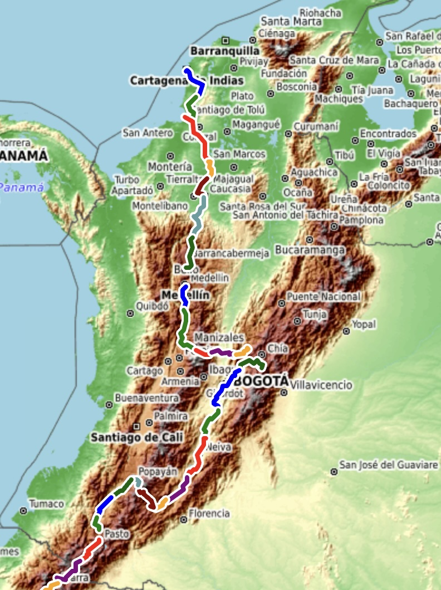
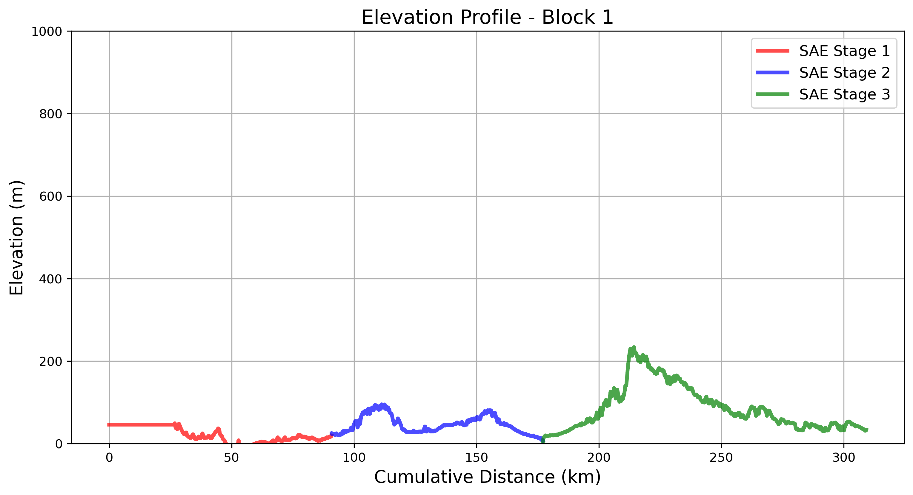
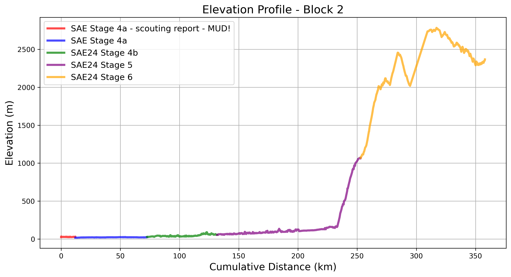
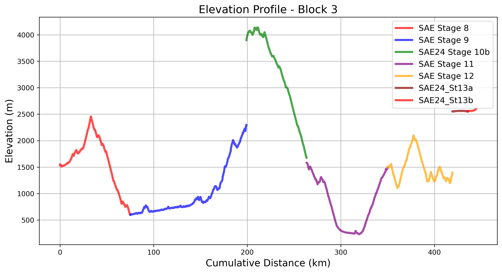
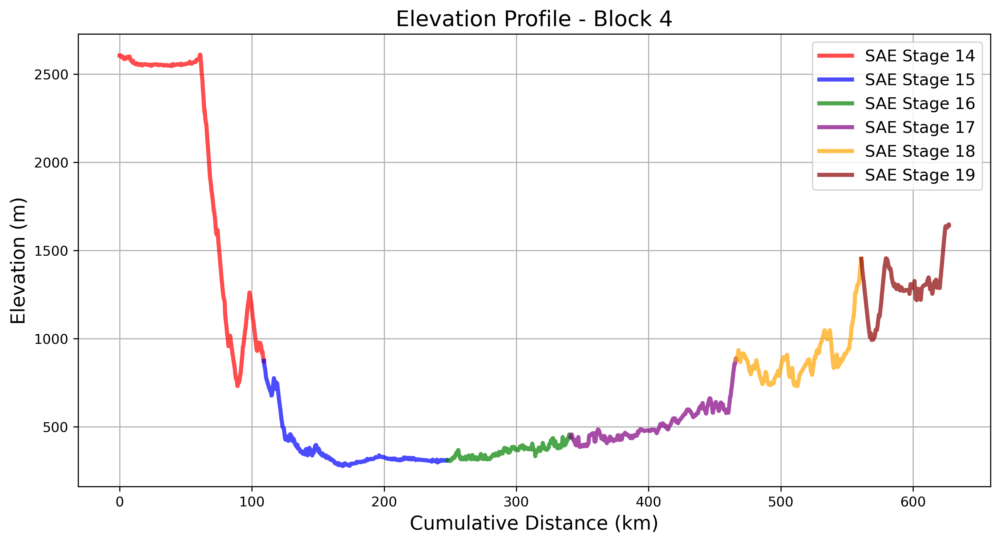
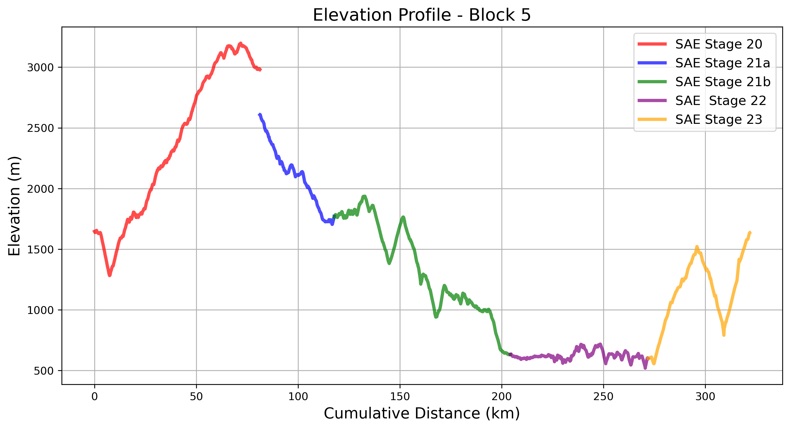

# Colombia  

We spent a month riding across Colombia, from 30 June to 30 July 2024.  

Markdown Syntax Figure


Myst Image 75%
```{image} _static/maps/colombia_rides_map.jpg
:width:75%
:alt: colombia_rides_map_img
:align: center
```

Myst Figure 80%
```{figure} _static/maps/colombia_rides_map.jpg
:width: 80%
:alt: colombia_rides_map
:name: colombia_rides_map

Rides Across Colombia (MystFig).
```

markdown style myst figure 85%
:::{figure-md} fig-label
:width: 85%
:align: center


Rides Across Colombia (label only).
:::


Colombia’s diverse geography, shaped by **three Andean Cordilleras**, offers a stunning variety of landscapes. This cycling journey moves from the **Caribbean Lowlands** into the **Cauca and Magdalena River Valleys**, climbs through **coffee-rich mountain ridges**, and traverses **high-altitude páramo** before heading south to Ecuador.  

A recurring theme emerges: **bridges at daily minima, and passes marking transitions between watersheds**. Rivers carve the land, defining the contours of the ride. Each **block** below highlights key geographic features, along with an interactive map of the actual routes ridden.

---

## **Block 1: Caribbean Lowlands - Cartagena to San Marcos**  
### Cartagena to San Marcos
The journey begins on the **warm, humid plains** near the Caribbean. 
The early stages are relatively flat, winding through **mangroves, wetlands, and tropical farmlands**. 
As the route moves inland, the rolling terrain hints at the climbs to come.  

Here’s the interactive map showing the actual routes ridden in **Block 1**:

<div style="display: flex; flex-wrap: wrap; gap: 20px; align-items: stretch; margin: 20px 0;">
    <div style="flex: 2; min-width: 200px; max-width: 300px;">
        <iframe src="_static/maps/block_1_map.html" 
                style="width: 100%; height: 400px; border: none; box-shadow: 0 0 5px rgba(0,0,0,0.2);"
                scrolling="no" allowfullscreen></iframe>
    </div>
    <div style="flex: 3; min-width: 400px; display: flex; align-items: center; justify-content: center;">
        
    </div>
</div>

---

## **Block 2: Cauca River Valley and Andean Foothills **  
### San Marcos to Medellin

### Bypassing the mud by boat in San Marcos, Colombia
[](https://www.youtube.com/watch?v=8uYH9JcSzBs)  
🎥 **[Watch on YouTube](https://www.youtube.com/watch?v=8uYH9JcSzBs)** – by [TDA Global Cycling](https://www.youtube.com/@tdacycling)  


Leaving the coastal plains, the route follows the **Cauca River Valley**, a deep trench between the **Western and Central Cordilleras**. This section is marked by **hot, flat riding along the river floodplain**, followed by **steep climbs into the Andean foothills**. The daily minima align with **Cauca River crossings**, while the maxima bring cool mountain air and breathtaking views.  

Here’s the interactive map showing the actual routes ridden in **Block 2**:

<div style="display: flex; flex-wrap: wrap; gap: 20px; align-items: stretch; margin: 20px 0;">
    <div style="flex: 2; min-width: 200px; max-width: 300px;">
        <iframe src="_static/maps/block_2_map.html" 
                style="width: 100%; height: 400px; border: none; box-shadow: 0 0 5px rgba(0,0,0,0.2);"
                scrolling="no" allowfullscreen></iframe>
    </div>
    <div style="flex: 3; min-width: 400px; display: flex; align-items: center; justify-content: center;">
        
    </div>
</div>

---

## **Block 3: The Coffee Highlands and Magdalena Watershed**  
### Medellin to Bogota

Riders from the [SiCLas Collective ](https://www.siclas.org/) gave us a great sendoff on our way out of Medellin

### Cycling Culture in Medellin
[](https://www.youtube.com/watch?v=Xp-i4u45kz4)  
🎥 **[Watch on YouTube](https://www.youtube.com/watch?v=Xp-i4u45kz4)** – by [TDA Global Cycling](https://www.youtube.com/@tdacycling)  

This section moves into **Colombia’s Coffee Axis**, where ridges and valleys create an undulating rhythm. The route shifts from the **Cauca River basin** to the **Magdalena River watershed**, with each day featuring **deep descents to tributaries, followed by grueling climbs** into cloud forests and coffee plantations.  

Here’s the interactive map showing the actual routes ridden in **Block 3**:

<div style="display: flex; flex-wrap: wrap; gap: 20px; align-items: stretch; margin: 20px 0;">
    <div style="flex: 2; min-width: 200px; max-width: 300px;">
        <iframe src="_static/maps/block_3_map.html" 
                style="width: 100%; height: 400px; border: none; box-shadow: 0 0 5px rgba(0,0,0,0.2);"
                scrolling="no" allowfullscreen></iframe>
    </div>
    <div style="flex: 3; min-width: 400px; display: flex; align-items: center; justify-content: center;">
        
    </div>
</div>

---

## **Block 4: Bogotá to the Tatacoa Desert**  

Crossing the **Eastern Cordillera**, the tour reaches Bogotá before plunging into the **Magdalena’s middle course**. The descent from Bogotá into the valley is dramatic, giving way to **warm, dry terrain**. The route then moves through the **Tatacoa Desert**, a striking landscape shaped by **millennia of water and wind erosion**.  

Here’s the interactive map showing the actual routes ridden in **Block 4**:

<div style="display: flex; flex-wrap: wrap; gap: 20px; align-items: stretch; margin: 20px 0;">
    <div style="flex: 2; min-width: 200px; max-width: 300px;">
        <iframe src="_static/maps/block_4_map.html" 
                style="width: 100%; height: 400px; border: none; box-shadow: 0 0 5px rgba(0,0,0,0.2);"
                scrolling="no" allowfullscreen></iframe>
    </div>
    <div style="flex: 3; min-width: 400px; display: flex; align-items: center; justify-content: center;">
        
    </div>
</div>

---

## **Block 5: The Colombian Massif and Magdalena Headwaters**  

Approaching **San Agustín**, the tour enters the **Colombian Massif**, where **the Magdalena River is born**. Each stage weaves through narrow ridgelines and deep ravines, transitioning from humid highlands to the **high-altitude páramo** of **Puracé National Park**. The high points between valleys showcase the rugged, untamed nature of the region.  

Here’s the interactive map showing the actual routes ridden in **Block 5**:

<div style="display: flex; flex-wrap: wrap; gap: 20px; align-items: stretch; margin: 20px 0;">
    <div style="flex: 2; min-width: 200px; max-width: 300px;">
        <iframe src="_static/maps/block_5_map.html" 
                style="width: 100%; height: 400px; border: none; box-shadow: 0 0 5px rgba(0,0,0,0.2);"
                scrolling="no" allowfullscreen></iframe>
    </div>
    <div style="flex: 3; min-width: 400px; display: flex; align-items: center; justify-content: center;">
        
    </div>
</div>


---

## **Closing Thoughts**  

Colombia’s geography presents an **ever-changing challenge**—from the **humid Caribbean lowlands** to the **high-altitude ridges of the Andes**. Rivers, valleys, and mountain passes define the rhythm of the ride. Every **bridge marks a low point**, and every **pass marks a transition**, reinforcing the deep connection between the landscape and the cyclist’s journey.

The road now turns south, deeper into **Ecuador, Peru, Bolivia, and beyond**—each new stage offering **its own valleys, rivers, and mountain passes** to cross.

---

### **Next Steps**  
Stay tuned for the next section of the journey: **Crossing Ecuador’s Avenue of the Volcanoes** 🚴‍♂️🌎.