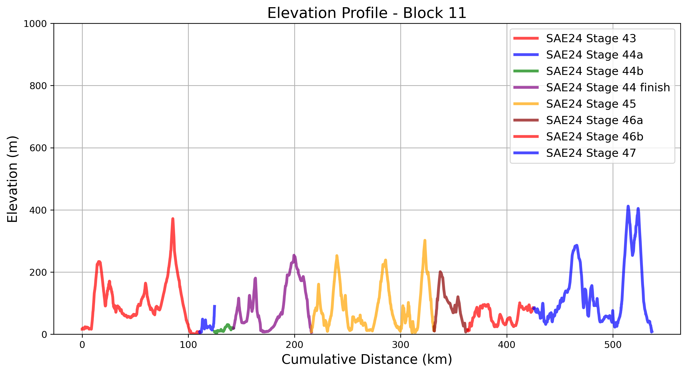

# Peru
## Cycling Through Coastal Deserts and Andean Heights  

Peru presents a dramatic shift in landscapes, from the **arid coastal plains** of the Pacific to the **towering peaks of the Andes**. The cycling route follows a mixture of **desert roads, high-altitude climbs, and deep river valleys**, testing endurance with some of the most **extreme elevation changes** of the entire expedition.

Each **block** below highlights key geographic features, along with an interactive map of the actual routes ridden.

---

## **Block 10: Chiclayo to Trujillo**  

This segment begins in the **coastal lowlands**, where vast deserts stretch toward the Pacific Ocean. The terrain is **relatively flat**, with long, wind-exposed roads leading into **Trujillo**, one of Peru’s oldest colonial cities.

    

        <iframe src="_static/maps/block_10_map.html" 
                style="width: 100%; height: 400px; border: none; box-shadow: 0 0 5px rgba(0,0,0,0.2);"
                scrolling="no" allowfullscreen></iframe>
    

    

        
    

---

## **Block 11: Trujillo to Lima**  

The journey continues along the **Pan-American Highway**, where cyclists face **intense heat, headwinds, and barren landscapes**. The coastline provides breathtaking ocean views, while the route includes key **cultural sites**, such as the ruins of **Chan Chan**.

    

        <iframe src="_static/maps/block_11_map.html" 
                style="width: 100%; height: 400px; border: none; box-shadow: 0 0 5px rgba(0,0,0,0.2);"
                scrolling="no" allowfullscreen></iframe>
    

    

        
    

---

## **Block 12: Lima to Nazca**  

Heading further south, the desert landscapes become even more **stark and isolated**. This stretch includes **long, open highways** flanked by **towering sand dunes** and **archaeological sites**, including the famous **Nazca Lines**.

    

        <iframe src="_static/maps/block_12_map.html" 
                style="width: 100%; height: 400px; border: none; box-shadow: 0 0 5px rgba(0,0,0,0.2);"
                scrolling="no" allowfullscreen></iframe>
    

    

        
    

### 5️⃣ Cycling the Peninsula de Paracas in Peru  
  
🎥 **[Watch on YouTube](https://www.youtube.com/watch?v=4dlJ3XqXRJY)** – by [TDA Global Cycling](https://www.youtube.com/@tdacycling)  

---

## **Block 13: Nazca to Abancay**  

Leaving the coast behind, the route ascends into the **Andes Mountains**. The climbs here are some of the **most grueling** of the entire expedition, with passes exceeding **4,000 meters** in altitude. The ride into **Abancay** introduces deep canyons and high-altitude plateaus.

    

        <iframe src="_static/maps/block_13_map.html" 
                style="width: 100%; height: 400px; border: none; box-shadow: 0 0 5px rgba(0,0,0,0.2);"
                scrolling="no" allowfullscreen></iframe>
    

    

        
    

---

## **Block 14: Cusco to Puno**  

The final Peruvian segment reaches the **Sacred Valley**, passing through the historic city of **Cusco** before continuing toward **Lake Titicaca**, the highest navigable lake in the world. The rolling altiplano offers a **stunning mix of Andean culture and breathtaking vistas**.

    

        <iframe src="_static/maps/block_14_map.html" 
                style="width: 100%; height: 400px; border: none; box-shadow: 0 0 5px rgba(0,0,0,0.2);"
                scrolling="no" allowfullscreen></iframe>
    

    

        
    

---

## **Closing Thoughts**  

Peru’s section of the South American Epic is **one of the most challenging and diverse**, offering a mix of **desert endurance rides** and **high-altitude ascents**. Riders experience a true test of **physical and mental resilience**, surrounded by **some of South America's most iconic landscapes**.

The journey now continues into **Bolivia**, where the expedition reaches the vast and rugged **Altiplano**. 🚴‍♂️